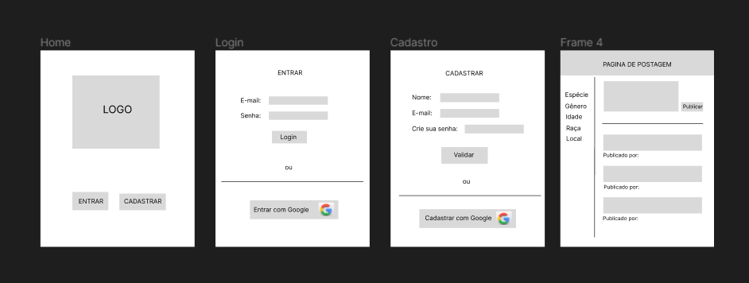
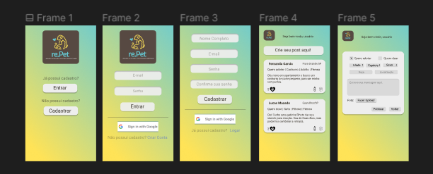
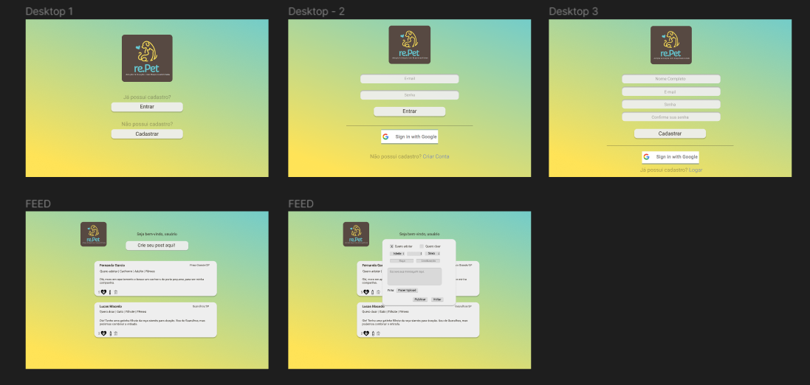

# Social Network - re.Pet 

Terceiro projeto do bootcamp Laboratoria.

* Link do Projeto: [re.Pet](https://rede-social-9ce25.web.app/)

## Índice

[1. Introdução](#1-introdução-🐶)
[2. Resumo do projeto](#2-resumo-do-projeto-🐱)
[3. Histórias de usuários](#3-histórias-de-usuário-💬)
[4. Desenvolvimento de projeto & protótipos](#4-desenvolvimento-de-projeto--protótipos-✒️)
[5. Testes de usabilidade](#5-testes-de-usabilidade-❗)
[6. Checklist dos objetivos de aprendizagem](#6-checklist-dos-objetivos-de-aprendizagem-✅)
[7. Ferramentas utilizadas](#7-ferramentas-utilizadas-🛠️)
[8. Desenvolvedoras](#8-desenvolvedoras-👩‍💻)

## 1. Introdução 🐶

Segundo dados da Organização Mundial da Saúde (OMS), o número de animais abandonados no Brasil chega a 30 milhões. Entre eles, 20 milhões são cachorros. 

O resultado da pesquisa é preocupante e merece atenção, por isso o incentivo à adoção de animais é algo que têm crescido na medida que as pessoas são conscientizadas, e projetos voltados para esse assunto são de grande importância. 

## 2. Resumo do projeto 🐱

Neste projeto foi desenvolvida em uma página web responsiva a rede social re.Pet - Adoção e Doação com Responsabilidade.

Com o objetivo de facilitar a divulgação e a busca por animais abandonados, o usuário poderá fazer o cadastro na rede social e através de um formulário é possível fazer uma postagem de adoção ou doação, descrevendo suas preferências e informando os seus dados.

Também é possível a interação do usuário após ter feito a publicação, onde o mesmo poderá editar ou excluir a sua própria postagem e/ou dar like/dislike em postagens de outros usuários e entrar em contato com o dono da postagem.

## 3. Histórias de usuário 💬
Para compreender as necessidades dos usuários, conduzimos entrevistas para identificar o que eles desejam encontrar em uma rede social voltada para adoção e doação de animais de estimação. Com base nos resultados, elaboramos as seguintes histórias de usuário para ilustrar suas necessidades e expectativas.

### 3.1 História 1

    “Eu como usuário gostaria de ter a opção de entrar caso já tenha o cadastro, ou criar uma nova conta.
    Além disso, entrar utilizando minha conta Google para que o Login seja mais rápido e fácil.”
 
>Critérios de aceitação: 

* Na tela home deverá existir a opção de entrar e cadastrar.
* Na tela de login deve ser possível entrar com e-mail e senha e com a conta Google.
* Na tela de cadastro deve ser possível realizar o preenchimento de um formulário contendo: nome, e-mail e senha.

>Definição de pronto: 

* O cadastro e o login deverão ser implementados utilizando o firebase.
* O código deverá estar responsivo (mobile e web).
* O código deverá estar coberto por testes unitários.
* O código deverá estar estilizado de acordo com Visual Studio.

### 3.2 História 2
    “Eu como alguém que gostaria de compartilhar um animal que está para adoção, 
    gostaria de poder publicar em forma de mensagem sobre as informações do animal”
 
>Critérios de aceitação

* Após o login e verificado se o usuário está logado, o mesmo será direcionado para a página de feed.

* Na página de feed aparecerá publicações existentes.

* Ter uma opção para criar uma nova publicação.

* O usuário poderá criar uma nova publicação preenchendo alguns inputs pré definidos e alguns campos livres.

>Definição de pronto: 

* O usuário só poderá acessar o feed após estar logado.
* O código deverá estar responsivo (mobile e web).
* O código deverá estar coberto por testes unitários.
* O código deverá estar estilizado de acordo com Visual Studio.

## 4. Desenvolvimento de projeto & Protótipos ✒️

Neste projeto, utilizamos a ferramenta Trello para organização e mapear as tarefas, adotando a metodologia de sprints e priorização de backlog. Para criar os protótipos de baixa e alta fidelidade para as versões mobile e web, utilizamos a ferramenta Figma, explorando diferentes opções de navegação.

Nesse projeto o desafio era desenvolver a partir do 'mobile first' e foi o start dos nossos prototipos que vocês conferem abaixo:

>### Baixa fidelidade mobile:

>### Alta fidelidade mobile:

>### Alta fidelidade desktop

## 5. Testes de usabilidade ❗

>Para realizar uma avaliação abrangente da experiência do usuário (UX) e da usabilidade da aplicação, conduzimos uma pesquisa que abordou diversos aspectos-chave da plataforma. 
Utilizamos uma abordagem centrada no usuário, com foco nas seguintes áreas de interesse: relevância da aplicação, fluidez no processo de cadastro e login, facilidade na realização de postagens, presença de campos adequados e relevantes nas postagens e satisfação geral com o design da interface. Além disso, incentivamos os usuários a relatarem qualquer problema (bugs) encontrado durante a utilização e a compartilharem sugestões de melhorias. Esses resultados foram essenciais para garantir uma experiência otimizada aos nossos usuários, com base em suas dores e expectativas.

>Recebemos um retorno predominantemente positivo sobre aspectos como usabilidade, intuitividade e aparência da aplicação. A aplicação foi considerada fácil de utilizar, intuitiva e o design visual foi considerado "clean e amigável".

A seguir, descrevemos os principais problemas encontrados pelos usuários e suas respectivas soluções:

1 - A janela para preencher as informações da postagem ficou parcialmente escondida na barra de tarefas, dificultando sua visualização e utilização adequada.

    Para solucionar este problema, optamos pela adição de uma barra de rolagem na janela modal do formulário de postagem, essa solução garante uma experiência mais consistente para os usuários, independentemente do tamanho da tela em que estão utilizando a aplicação, sem modificar a estrutura do formulário.

2 - Ao cadastrar o telefone, não foi estabelecido um limite de caracteres, o que pode levar a erros de digitação e dificultar o contato correto.

    Para este problema, adicionamos requisitos específicos no campo “contato”  do formulário, como a limitação da quantidade de dígitos para nove dígitos,  evitando assim possíveis erros de digitação.

3 - Alguns usuários relataram que, ao realizar uma postagem com um texto longo, a visualização no feed não se ajustou adequadamente ao tamanho, resultando em um transbordamento do conteúdo da postagem.
	
	Para solucionar este problema, adicionamos uma barra de rolagem no campo “mensagem” da postagem publicada em caso de textos muito extensos, optou-se por essa solução para preservar a consistência do tamanho das postagens, sem limitar o conteúdo das mesmas.

4- Após editar uma postagem, não era possível editar a postagem novamente.

	Foi identificado um problema no envio do formulário de edição de conteúdo da postagem, para solucionar esse problema, foi adicionado um evento preventDefault( ) no formulário de edição. Isso permite que o usuário permaneça na mesma página e continue interagindo com a postagem, incluindo a possibilidade de realizar edições adicionais, se necessário.

## 6. Checklist dos objetivos de aprendizagem ✅

[✓] Uso de HTML semântico

[✓] Uso de seletores de CSS

[✓] Uso de seletores de DOM

[✓] Manipulação de eventos de DOM (listeners, propagação, delegação)

[✓] Variáveis (declaração, atribuição, escopo)

[✓] Promessas

[✓] Single Page Application (SPA)

[✓] Testes assíncronos

[✓] Uso de mocks e espiões

[✓] Firebase

[✓] Firestore

## 7. Ferramentas utilizadas 🛠️
 

## 8. Desenvolvedoras👩‍💻 

Cristyna Costa

Fernanda Caniçais

Fernanda Souza

