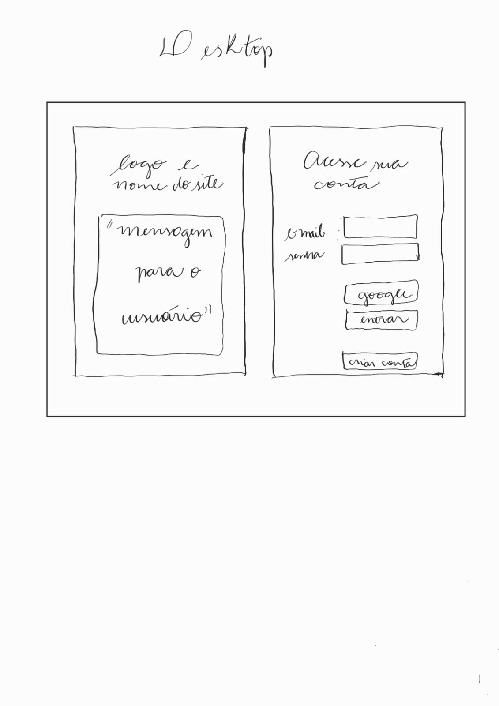

# Rede Social - TravellerBook

Acesse o projeto: [aqui](http://)  
  
Status do projeto: Em desenvolvimento ✔ 
Tecnologias utilizadas:  

  <a href="https://developer.mozilla.org/en-US/docs/Learn/Getting_started_with_the_web/HTML_basics">
  
  <a href="https://developer.mozilla.org/en-US/docs/Web/CSS">
  
  <a href="https://developer.mozilla.org/en-US/docs/Learn/JavaScript/First_steps/What_is_JavaScript">
  
  <a href="https://git-scm.com/">
  
  <a href="https://github.com/">
  
  <a href="https://jestjs.io/pt-BR/">
  
  <a href="https://figma.com/">
  
  <a href="https://firebase.google.com/">
  
  <a href="https://code.visualstudio.com/">
  
   <a href="https://nodejs.org/en">
  

## Índice

- [1. Prefácio](#1-prefácio)
- [2. Resumo do projeto](#2-resumo-do-projeto)
- [3. Protótipos de baixa e alta fidelidade](#3-protótipos-de-baixa-e-alta-fidelidade)
- [4. Histórias do usuário](#4-historias-do-usuário)
- [5. Objetivos Alcançados](#5-objetivos-alcançados)
- [6. Desenvolvedoras](#6-desenvolvedoras)

---

## 1. Prefácio

Desenvolvido no bootcamp da Laboratória, a ideia era criar uma rede social, tendo o escopo do tema,
do layout e historias do usuário totalmente desenvolvido por nós.

## 2. Resumo do projeto

TravellersBook é uma rede social desenvolvida para que todas as pessoas que amam viajar possam
compartilhar suas experiências e receber dicas sobre viagens. Neste projeto, foi desenvolvida
uma SPA (Single Page Application) responsiva. Nela, é possível fazer, editar, curtir e excluir publicações.

Além disso permite à qualquer usuário criar uma conta de acesso,
logar-se com ela, criar, editar, deletar e dar likes em publicações.

O objetivo principal de aprendizagem deste projeto foi construir uma [Single-page
Application
(SPA)](https://pt.wikipedia.org/wiki/Aplicativo_de_p%C3%A1gina_%C3%BAnica)
[_responsiva_](https://curriculum.laboratoria.la/pt/topics/css/02-responsive) (com mais de uma tela/ página) na
qual é possível **ler e escrever dados**.

Logotipo e nome:
O logotipo passa a idéia de estar sempre nas nuvens, viajando, criando experiências.
O nome "Travellers Book" remete aos diarios de bordos, caderno de anotações de viagens.

Slogan:  
"Explore, compartilhe, viaje com seu guia de aventuras."

Apresentação do site:
Imagine ter acesso a um mundo de conhecimento de viajantes experientes, prontos para compartilhar suas dicas e segredos para criar viagens inesquecíveis. Aqui você pode explorar destinos exóticos, cidades vibrantes e gastronomias incríveis de forma mais autêntica.
Prepare-se para voar em um universo de descobertas. Nós da TravellersBook acreditamos que a viagem é muito mais do que um destino - é uma jornada enriquecedora que nos conecta e nos transforma.

## 3. Protótipos de baixa e alta fidelidade

### Protótipo de baixa fidelidade:

### Protótipo de alta fidelidade:

## 4. Historias do usuário

Foram definidas as seguintes histórias de usuários, com respectivos critérios de aceitação e definições de pronto:

I - Página Login

a) Novo usuário deseja ter a opção de criar uma nova conta no site, fornecendo nome, endereço de e-mail e senha para registrar e acessar recursos exclusivos.

b) Usuário não autenticado deseja ter a opção de fazer login usando o endereço de e-mail e senha para acessar a conta pessoal no site.

c) Novo usuário deseja ter a opção de fazer login usando a conta Google para acessar o site com mais facilidade.

d) Usuário de dispositivo móvel deseja ter uma experiência de login responsiva, onde os campos de entrada e botões se ajustem à tela do dispositivo e sejam fáceis de usar.

e) Usuário que esqueceu a senha deseja ter a opção de redefinir a senha usando o endereço de e-mail registrado.

f) Usuário frequente deseja ter a opção de lembrar as credenciais de login para que não precise inseri-las todas as vezes que visitar o site.

II - Página Register

III - Página Feed

a) Os usuários podem explorar uma página que exibirá todos os posts disponíveis.

b) Cada post conterá o texto da experiência do usuário, seu nome e a data em que foi publicado. Dessa forma, poderei ler as experiências compartilhadas pelos outros usuários.

c) Para interagir com os posts, terei a opção de dar um like individualmente a cada post que me agradar. Isso me permitirá demonstrar meu apoio e apreciação pelos conteúdos compartilhados.

d) Caso deseje voltar à tela inicial de Login, terei a opção de retornar à Home diretamente do feed. Isso me proporcionará a flexibilidade de explorar outros recursos do sistema ou realizar um novo login, se necessário.

e) Além disso, dentro da página do Feed, encontrarei a opção de publicar um novo post. Isso me permitirá compartilhar minhas próprias experiências e contribuir com a comunidade.

f) Por fim, caso decida sair da página do Feed, terei a opção de sair diretamente, encerrando minha sessão no sistema de forma conveniente.

## 5. Objetivos alcançados

- [x] Criação de uma SPA;
- [x] Responsivo;
- [x] Criação dos testes;
- [x] Testes unitários cobrem mais do que 70% de statements, functions, lines e branches;
- [x] Login através do firebase;
- [x] Usuário pode criar conta;
- [x] Usuário pode logar com google e/ou e-mail e senha;
- [x] Somente usuários com contas válidas têm acesso permitido;
- [x] A conta do usuário deve ser um email válido;
- [x] Formulários de registro e login passam por uma validação;
- [x] Em casos de erro, mensagens descritivas devem são exibidas para ajudar o usuário;
- [x] O conteúdo da timeline apenas é mostrado se o usuário estiver logado;
- [x] Usuário pode publicar posts;
- [x] Usuário pode curtir publicações;
- [x] Usuário pode editar e excluir as suas publicações;
- [x] Posts são atualizados em tempo real;

## 6. Desenvolvedoras

Aline Plampona

 

Alessandra

 

Marina Braz

 
